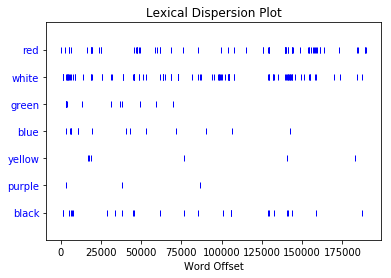

<h1>Adjacency Matrices for Descriptors in <i>Dracula</i></h1>

<h2>Prerequisites</h2>
<ul>
    <li>You are familiar with the main characters of the novel.  A quick read of the plot and main characters of the <a href="https://en.wikipedia.org/wiki/Dracula" target="_blank">wiki</a> will suffice.  You could also watch Francis Ford Coppola's <i><a href="https://www.imdb.com/title/tt0103874/" target="_blank">Bram Stoker's Dracula</a></i>; but, be aware that they inject a love narrative between Dracula and Mina that does not exist in the novel, and will seem contraditactory to the characterization of Dracula that we develop below.</li>
    <li>Familiarity with adjacency matrcies, either from the <a href="https://en.wikipedia.org/wiki/Adjacency_matrix" target="_blank">wiki</a> or by reading the previous article, Matrix Multiplication to Find Connecting Flights.</li>
</ul>

<h2>Introduction</h2>
I think it is fair to say that word choice is a somewhat contentious form of textual analysis.  I sense that students often find it overkill (I'm thinking of the blue curtain meme), teachers find it an accessible gateway into deeper forms of analysis, and professionals find it rather superficial.  But, when reading a text we often come across curiosities that warrant deeper investigation.  That is, it seems desirable to have methods to quantify or substantiate our hunches.  For example, if we presuppose that authors purposefully employ their adjectives, we might question what the consistent use of some particular adjective would indicate about the characters and themes of the text. Reading <i>Dracula</i>, it is hard not to notice the heavy use of red and white.  In this article, we will work to define the circumstances in which Stoker uses these two colors, and then develop some indication that he uses red and white to connote Dracula's association with appetite and death, respectively.  In doing so, we will hopefully find some substantiation of this characterization of Dracula, which is likely to be <i>felt</i> while reading the text.

Please note that literary analysis is inherently complex due to the layered meanings of most texts.  To extract word choice, while ignoring historical and social context, is at best incomplete.  <i>Dracula</i> itself hints at the need for feminist, religious, and colonialist readings, and the commentary we develop is not intended to supplant other forms of analysis.  Furthermore, I wasn't able to find a source for the type of analysis that we will perform below, and it is based on my own ideas.  As such, its validity should not be taken as anything more than suggestive, and a much more thorough investigation, applied to many texts, is certainly needed to discover the value of such a method.

Also, I expect that more people are familiar with the character of Dracula through popular culture than through reading the original novel, and it is quite interesting to inspect the disparity between these two sources.  Dracula is understood to be, first and foremost, seductive and cunning when he arises in popular culture.  He is a creature that will convince, mostly, young women to leave their homes or to trick them into allowing him entry so that he may then feed on them.  However, in the text, with some minor exceptions of moments of creativity, some courtly manners, and declarations of his cleverness by Van Helsing, Dracula is portrayed as the embodiment of death and appetite.  He is not a nuanced or tortured intellect, but is a bodily force that consumes and moves on.  There isn't even much indication that he is a sadist, which would at least indicate some level of depth to his actions.  And, it is this inversion of the corporeal and intellectual between the source text and popular conception that I find so intriguing.  Not to digress too far from the topic at hand, but there is an interesting similarity with the creature in Frankenstein, but that the effect is in the opposite direction.  Our popular conception is of a mindless body that wreaks havoc (perhaps unintentionally, you could argue, as a child would), but in Mary Shelley's original text he is a developed and nuanced intellect.  This is just food-for-thought; now back to the task at hand.

<h2>The Use of Red and White</h2>
To begin, we would like to establish that Stoker actually uses red and white more commonly than we might initially expect.  To do this, let's look at the 30 most common adjectives used in the novel:


```python
Counter(pos_tags_adj).most_common(30)
```


    [('good', 202),
     ('more', 189),
     ('other', 186),
     ('old', 185),
     ('own', 185),
     ('such', 182),
     ('great', 173),
     ('poor', 171),
     ('little', 161),
     ('*', 154),
     ('dear', 153),
     ('much', 152),
     ('last', 123),
     ('same', 110),
     ('first', 108),
     ('many', 102),
     ('white', 101),
     ('terrible', 99),
     ('full', 97),
     ('long', 89),
     ('few', 86),
     ('strange', 81),
     ('new', 74),
     ('dead', 70),
     ('whole', 66),
     ('open', 65),
     ('red', 64),
     ('ready', 62),
     ('strong', 58),
     ('sweet', 54)]


And, we note that both red and white are in this list, alongside such general adjectives as whole, many, and open.  This seems to indicate that there is something worth investigating.  

But, it may turn out that Stoker wrote a particularly colorful novel, and he simply loves to establish a rich environment for his characters through lots of description.  So, let's see how the use of red and white compare to other major colors:


```python
percRW = math.floor((text.count('red')+text.count('white'))/(text.count('red')+text.count('white')+text.count('green')+text.count('blue')+text.count('yellow')+text.count('purple')+text.count('black'))*100)
counts = "Red: " + str(text.count('red')) + "\n" + "White: " + str(text.count('white')) + "\n" + "Green: " + str(text.count('green')) + "\n" + "Blue: " + str(text.count('blue')) + "\n" + "Yellow: " + str(text.count('yellow')) + "\n" + "Purple: " + str(text.count('purple')) + "\n" + "Black: " + str(text.count('black')) + "\n" + "\n" + "Red and White as Percentage of Major Color References: " + str(percRW) + "%"
print(counts)
```

    Red: 69
    White: 101
    Green: 14
    Blue: 14
    Yellow: 6
    Purple: 3
    Black: 26
    
    Red and White as Percentage of Major Color References: 72%


And, we see that red and white occur much more than other colors.  Their exceptional use justifies continuing our investigation.

While we have shown that red and white happen to be used in large quantites, this doesn't guarantee that their use occurs throughout the book.  It could be that Stoker has a character repeat red 50 times in dialogue over the course of only a couple pages.  For example, Renfield is debatably mad and fixated with blood; perhaps he simply chants "red, red, red,..." for an entire page.  To investigate this, let's look at the dispersion of red, white, and the other colors throughout the text:


```python
text.dispersion_plot(['red','white','green','blue','yellow','purple','black'])
```





Here, each hash indicates that a word occurs, and the horizontal axis here indicates where in the text that occurs, starting at word 0 and progressing to the end of the text.  While we can observe a few gaps and clusters in the occurence of red and white, this certainly indicates that they are used fairly consistently throughout the course of the text.

These results indicate that there certainly seems to be something worth investigating.  If you performed this analysis on some other random text, it is not very likely that red and white would hold such a notable place both above other colors and amongst very common adjectives.  Let's now turn our attention to how these colors are used.

To do so, let's first look to see if their use is associated with particular nouns.  Let's start with white.  We can list all of the nouns that are associated:


```python
Counter(white_nouns)
```


    Counter({'ashes': 1,
             'blanket': 1,
             'candle': 1,
             'church': 1,
             'cloud': 1,
             'clouds': 1,
             'edges': 3,
             'face': 9,
             'faces': 1,
             'figure': 17,
             'flesh': 1,
             'flowers': 3,
             'foam': 1,
             'forehead': 2,
             'frock': 1,
             'garments': 1,
             'gloves': 1,
             'hair': 6,
             'hairs': 1,
             'hands': 1,
             'heat': 1,
             'light': 1,
             'lips': 2,
             'mist': 2,
             'moustache': 4,
             'napkin': 1,
             'nightdress': 1,
             'nightrobe': 1,
             'nose': 1,
             'paper': 1,
             'road': 1,
             'sheepskins': 1,
             'sheet': 1,
             'shirts': 1,
             'skin': 11,
             'sleeves': 2,
             'teeth': 15,
             'throat': 1,
             'tombs': 1,
             'tree': 1,
             'trousers': 1,
             'undergarment': 1,
             'water': 1,
             'waves': 1,
             'wings': 1})


But, this is more than a little difficult to read and extract any meaning.  As such, let's limit our results to the six most common:


```python
Counter(white_nouns).most_common(6)
```


    [('figure', 17),
     ('teeth', 15),
     ('skin', 11),
     ('face', 9),
     ('hair', 6),
     ('moustache', 4)]


And, let's do the same for red:


```python
Counter(red_nouns).most_common(6)
```


    [('eyes', 12), ('light', 8), ('lips', 7), ('scar', 6), ('mark', 6), ('sun', 5)]


And if we recall that white occurs 101 times and red occurs 69 times in the text, these 6 nouns represent 61% and 63% of their usage, respectively.  

If we agree that Stoker uses red and white an inordinate amount of times, and we notice that he predominantly uses them with particular nouns, then it is reasonable to ask what effect or meaning he intends by doing so.  Furthermore, we need to question why they both occur so regularly with body parts and lighting.  At this point, while these connections are suggestive of deeper intention of Stoker's usage, they don't really show us what precisely that intention is.  In order to develop some deeper associations, we will need to connect the adjectives with their associated nouns and the character who possesses them.  We tackle this in the next section, and finally introduce some linear algebra to help us do so.

Sidenote: Perhaps you are still unconvinced there is anything going on here.  This is certainly fair but has equal responsibility to be supported by argumentation.  If we want to instead argue that this is simply coincidence, we need to be able to reconcile why he finds such frequent need to remind the reader that some teeth are white and some lips are red.  These are default colors for teeth and lips.  And, if it is coincidence, why did he not do so with the color of every other item in the text?  Why are body parts the only items for which he consistently established their color?

<h2>The Associations of Red and White</h2>
Now we would like to inspect the connections between red and white, their associated nouns, and the characters who possess these traits.  This creates a number of moving pieces, and we will begin by using an adjacency matrix to help organize all of the connections.

Let's first look at the adjacency matrix for white:

$$
\begin{array}{r|ccccccc}
& white & figure & teeth & skin & face & hair & moustache & Dracula & Lucy & Van Helsing & Mina & Jonathan \\
\hline
white       & 0  & 17 & 15 & 11 & 9  & 6  & 4  & 28 & 21 & 3  & 4  & 1 \\
figure      & 17 & 0  & 0  & 0  & 0  & 0  & 0  & 5  & 9  & 0  & 0  & 0  \\
teeth       & 15 & 0  & 0  & 0  & 0  & 0  & 0  & 11 & 3  & 0  & 0  & 0  \\
skin        & 11 & 0  & 0  & 0  & 0  & 0  & 0  & 2  & 7  & 0  & 2  & 0  \\
face        & 9  & 0  & 0  & 0  & 0  & 0  & 0  & 3  & 2  & 2  & 2  & 0  \\
hair        & 6  & 0  & 0  & 0  & 0  & 0  & 0  & 3  & 0  & 1  & 0  & 1  \\
moustache   & 4  & 0  & 0  & 0  & 0  & 0  & 0  & 4  & 0  & 0  & 0  & 0  \\
Dracula     & 28 & 5  & 11 & 2  & 3  & 3  & 4  & 0  & 1  & 1  & 1  & 1  \\
Lucy        & 21 & 9  & 3  & 7  & 3  & 0  & 0  & 1  & 0  & 1  & 1  & 0  \\
Van Helsing & 3  & 0  & 0  & 0  & 3  & 1  & 0  & 1  & 1  & 0  & 0  & 1  \\
Mina        & 4  & 0  & 0  & 2  & 3  & 0  & 0  & 1  & 1  & 0  & 0  & 1  \\
Jonathan    & 1  & 0  & 0  & 0  & 0  & 1  & 0  & 1  & 0  & 1  & 1  & 0  \\
\end{array}
$$

where each entry indicates a count of the instances between the color, a noun, or a characater.  For example, if there is an instance where Dracula is described as having white teeth, then we add 1 to the tallies for white-teeth, Dracula-teeth, and Dracula-white.  

You will notice that, per usual, an adjacency matrix is a square, symmetric matrix.  In terms of the underlying graph, recall that an adjacency matrix may simply use a binary to indicate if two vertices are connected.  For our adjacency matrix, we are using the interpretation that each value corresponds to the number of edges between adjacent vertices.  So, for the example at hand, we have the advantage of being able to demonstrate how many connections exist within the text.  We could instead normalize all of these values and use a weighted adjacency matrix, but doing so would be equivalent for our desired interpretations.  For the character-to-character values, I have left these as a binary based on how strongly the two characters interact with each other.  We could, theoretically, use the number of shared scenes or references, but this will suffice for our purposes here.

If we now use this to look at the sum of the elements in a character's vector, then we get a sense of how central the character is to the associations at hand.  We may choose either the row or column vector, as they are equivalent here, and we will keep the white dimension even though it contains information redundant to the noun dimensions.  Specifically, we get:

$$
\begin{array}{r|c}
Character & Sum \\
\hline
Dracula & 62 \\
Lucy & 46 \\
Mina & 10 \\
Van Helsing & 12 \\
Jonathan & 5 \\
\end{array}
$$

To be clear, this indicates the number of edges, i.e., how many walks of length 1, each character (as a vertex) possesses.  We can immediately see that Dracula is at the heart of the matter, but also that Lucy is rather close.  It also is noteworthy that, while graphs are nice to visualize simpler problems, they become very hard to interpret for more complex problems (like having 62 edges for one node) and the linear algebraic representations become easier to inspect.

Before we come to any sort of interpretation, let's extend these results, so that we may inspect the number of walks of length 2 and 3.  Recall, if our adjacency matrix is denoted $A_w$, then we get this information by finding $A^2_w$ and $A^3_w$.  These are:


```python
print(a_2)
```

    [[2019  329  371  211  168   88  112  362  328   74   90   41]
     [ 329  395  337  260  195  117   88  485  362   65   82   22]
     [ 371  337  355  208  177  123  104  423  326   59   74   26]
     [ 211  260  208  178  132   72   52  317  235   42   53   15]
     [ 140  186  174  123  108   65   48  258  196   32   41   16]
     [  88  117  123   72   66   47   36  170  130   22   28   10]
     [ 112   88  104   52   48   36   32  112   88   16   20    8]
     [ 362  485  423  317  261  170  112  972  688   95  124   33]
     [ 337  362  326  235  198  130   88  691  589   70  105   24]
     [  83   65   59   42   33   22   16   98   70   19   21    5]
     [  99   82   74   53   42   28   20  127  105   21   29    5]
     [  41   22   26   15   18   10    8   33   24    5    5    5]]


with the character vector sums
$$
\begin{array}{r|c}
Character & Sum \\
\hline
Dracula & 4042 \\
Lucy & 3155 \\
Mina & 685 \\
Van Helsing & 533 \\
Jonathan & 212 \\
\end{array}
$$


```python
print(a_3)
```

    [[33614 39085 35251 25409 20733 13315  9524 64429 48812  7212  9565  2633]
     [39166 11276 11356  7287  5943  3516  3256 17233 14317  2363  3095  1078]
     [35278 11356 11196  7357  5985  3580  3176 18195 14255  2365  3029  1050]
     [25490  7287  7357  4706  3840  2274  2112 11017  9317  1536  2031   695]
     [20295  5434  5526  3510  2841  1662  1592  8006  6544  1171  1492   536]
     [13324  3516  3580  2274  1842  1070  1032  5219  4126   753   938   355]
     [ 9524  3256  3176  2112  1716  1032   896  5336  4064   676   856   296]
     [64372 17206 18186 10990  8895  5216  5336 20529 17168  3471  4297  1723]
     [48914 14485 14423  9422  7398  4189  4112 17426 14220  2841  3518  1333]
     [ 7305  2531  2533  1641  1371   816   724  3726  3003   510   655   243]
     [ 9658  3263  3197  2136  1737  1001   904  4552  3671   646   823   304]
     [ 2651  1078  1050   695   570   355   296  1729  1321   231   292    94]]


with the character vector sums

$$
\begin{array}{r|c}
Character & Sum \\
\hline
Dracula & 177389 \\
Lucy & 142281 \\
Mina & 31892 \\
Van Helsing & 25058 \\
Jonathan & 10362 \\
\end{array}
$$

Let's now repeat this work for the color red, and we will interpret our findings in the next section.

First, we have the adjacency matrix for red:

$$
\begin{array}{r|ccccccc}
& red & eyes & light & lips & mark & scar & sun & Dracula & Lucy & Van Helsing & Mina & Jonathan \\
\hline
red         & 0  & 12 & 8  & 7  & 6  & 6  & 5  & 23 & 6  & 0  & 9  & 0 \\
eyes        & 12 & 0  & 0  & 0  & 0  & 0  & 0  & 11 & 0  & 0  & 1  & 0  \\
light       & 8  & 0  & 0  & 0  & 0  & 0  & 0  & 3  & 2  & 0  & 0  & 0  \\
lips        & 7  & 0  & 0  & 0  & 0  & 0  & 0  & 6  & 1  & 0  & 0  & 0  \\
mark        & 6  & 0  & 0  & 0  & 0  & 0  & 0  & 0  & 3  & 0  & 3  & 0  \\
scar        & 6  & 0  & 0  & 0  & 0  & 0  & 0  & 2  & 0  & 0  & 4  & 0  \\
sun         & 5  & 0  & 0  & 0  & 0  & 0  & 0  & 1  & 0  & 0  & 1  & 0  \\
Dracula     & 23 & 11 & 3  & 6  & 0  & 2  & 1  & 0  & 1  & 1  & 1  & 1  \\
Lucy        & 6  & 0  & 2  & 1  & 3  & 0  & 0  & 1  & 0  & 1  & 1  & 0  \\
Van Helsing & 0  & 0  & 0  & 0  & 0  & 0  & 0  & 1  & 1  & 0  & 0  & 1  \\
Mina        & 9  & 1  & 0  & 0  & 3  & 4  & 1  & 1  & 1  & 0  & 0  & 1  \\
Jonathan    & 0  & 0  & 0  & 0  & 0  & 0  & 0  & 1  & 0  & 1  & 1  & 0  \\
\end{array}
$$

Now we would like to inspect the character vector sums for the adjacency matrices representing the walks of length 1, 2, and 3, given by, say, $A_r$, $A^2_r$, and $A^3_r$, respecitively.  All together, these are:

$$
\begin{array}{ccc}
\begin{array}{r|c}
Character & Sum \\
\hline
Dracula & 50 \\
Mina & 21 \\
Lucy & 15 \\
Jonathan & 3 \\
Van Helsing & 3 \\
\end{array} & \begin{array}{r|c}
Character & Sum \\
\hline
Dracula & 2346 \\
Mina & 921 \\
Lucy & 642 \\
Jonathan & 74 \\
Van Helsing & 68 \\
\end{array} & \begin{array}{r|c}
Character & Sum \\
\hline
Dracula & 76739 \\
Mina & 28484 \\
Lucy & 20284 \\
Jonathan & 3335 \\
Van Helsing & 3062 \\
\end{array} \\
\end{array}
$$

And, again we see that Dracula holds the first position (although, he holds a very substantial margin here that he did not hold for white) and Lucy has a significant number.  But, it is noteworthy that Mina now also has a substantial portion.

Now that we have collected our results, let's turn to providing some interpretation.

<h2>Interpretation</h2>
If we look at our linear algebraic results for white, we find that Dracula and Mina are almost equally central and have approximately 5 times as many connections as the other characters.  To be clear, we should not expect any character to have zero connections, both because they are connected to the other charactes and Stoker's use of a general color does not need to be unifaceted.  The proportions of how white is used are the real clues.  But, what attribute do Dracula and Lucy possess (or lack) that the other characters do not? To answer this, let's look at the specific nouns associated to white, namely figure, teeth, skin, face, hair, and moustache. All of these are associated with the body, but more precisely, all of these are the whitened versions that we would expect to see in a corpse.  Particularly in the use of figure, skin, and face, Stoker deliberately reminds the reader that Dracula and Mina are the "dead Un-Dead". Thus, we should not picture them as having the usual pigmentation that we would expect, but rather as walking corpses.  Stoker's use of hair and moustache are much the same, although this is slightly complicated by Van Helsing being old and having white hair.  The interpretation for teeth is two-fold: (i) exposed teeth also signify a corpse; (ii) they are Dracula's means for bringing about death.  While I do not want to wander too deep into corroborating textual evidence, I think it is noteworthy that Stoker directly references the legend of the <a href="https://en.wikipedia.org/wiki/White_Lady_(ghost)" target="_blank">white lady</a> in chapter six. Ultimately, Stoker's use of the color white is very strongly associated with death, and it serves as a useful reminder of the strange nature of Dracula and his victim in a time where the images of vampires, zombies, and the living undead were not widespread in the culture, as they are today.

If we look at our linear algebraic results for red, we find that Dracula is incredibly central relative to the other characters and that Mina and Lucy have 7-9 times more connections than Jonathan and Van Helsing.  These proportions are rather curious: what is it that Dracula has a lot of, Mina and Lucy have a good deal of, and Jonathan and Van Helsing have very little of? Again, to answer this we need to look at the specific nouns associated to red, namely eyes, light, lips, mark, scar, and sun.  From reading the text, red light and the red sun are used to paint a particular scene, well, red.  Light is also used in the sense of the light in his eyes, creating a bridge to the other four nouns.  Eyes, lips, mark, and scar all connect to organs that can be flushed with blood.  That is to say, all of the nouns express a notion that a character or an environment are bathed in blood, the very thing that nourishes the vampire characters.  As such, Stoker uses red to signify appetite, and you could argue a deranged or animalistic version of appetite at that (note: you could certainly read "sensuality" or "carnality" here and I wouldn't argue much, but I think the baser version "appetite" is more accurate).  Dracula and Lucy's connection with appetite are clear as Stoker demonstrates them feeding, but Mina is slightly more nuanced.  Mina begins the transformation to vampire and hence is strongly connected to red, but she never completes this transformation by dying.  This is consistent with our results above that Mina is not strongly associated with white and death.

Jonathan is an interesting case that I want to briefly mention.  He is clearly victimized by Dracula, and thus confronts appetite and death.  But, he never actually comes to possess any of these attributes.  This seems consistent with our work above in that Jonathon has no substantial connection with red nor white.

<h2>Closing Thoughts</h2>
Ultimately, besides attempting to find a somewhat novel use of matrices and matrix multiplication, my objectives for this article were to encourage the inclination to quantify your hunches and to work with, not against, the results of such quantifications.  In practice, we may find that some problems (like literary analysis) are not particularly amenable to mathematical arguments, but we should remain open to the possibility that some portion of the question will bend to them. The above results are in no way definitive proof of Stoker's or the text's intended meaning; we would, at least, need to situate our analysis amongst other methods.  However, I think we have clearly established that red and white are used in a substantial way, and their connections with certain characters are too consistent to simply be accidental.  That is, your version of the Interpretations section may differ from mine, but to call the use of red and white incidental is to actively work against the work in the first two sections.

In the beginning, I claimed that Dracula's character almost exclusively consists of death and appetite.  I have not shown this exclusitivity yet, and perhaps while he possesses these traits he may have many other good traits that create a nuanced character.  Within the text, this is not the case though.  To substantiate this, we could apply similar methods to the other common adjectives to see Dracula's connection to those with a positive or negative connotation.  Instead, I think it would be a better use of your time to read the original novel, create your own arguments, and draw your own conclusions.  Happy reading.

<h2>Appedix: Tools Used</h2>
To do our textual analysis, we will use the Natural Language Toolkit, <a href="https://www.nltk.org/" target="_blank">NLTK</a>.  It has a very interesting book that will walk you through some common techniques of natural language process, if you are interested.

First, we need to install the package and setup our other libraries:


```python
!pip install -U nltk
```

    Requirement already up-to-date: nltk in /home/nbuser/anaconda3_420/lib/python3.5/site-packages (3.3)
    Requirement already satisfied, skipping upgrade: six in /home/nbuser/anaconda3_420/lib/python3.5/site-packages (from nltk) (1.11.0)


```python
import nltk
nltk.download('punkt') 
```

    [nltk_data] Downloading package punkt to /home/nbuser/nltk_data...
    [nltk_data]   Unzipping tokenizers/punkt.zip.


    True


```python
import numpy as np
import matplotlib
from collections import Counter
```

Now, we need to access the plain-text file and feed it into NLTK:


```python
f = open('dracula.txt')
raw = f.read()
```


```python
tokens = nltk.word_tokenize(raw)
```


```python
text = nltk.Text(tokens)
```

Now that we can access the text, we can use some handy functions to do so basic language analysis:


```python
import math
percRW = math.floor((text.count('red')+text.count('white'))/(text.count('red')+text.count('white')+text.count('green')+text.count('blue')+text.count('yellow')+text.count('purple')+text.count('black'))*100)
counts = "Red: " + str(text.count('red')) + "\n" + "White: " + str(text.count('white')) + "\n" + "Green: " + str(text.count('green')) + "\n" + "Blue: " + str(text.count('blue')) + "\n" + "Yellow: " + str(text.count('yellow')) + "\n" + "Purple: " + str(text.count('purple')) + "\n" + "Black: " + str(text.count('black')) + "\n" + "\n" + "Red and White as Percentage of Major Color References: " + str(percRW) + "%"
print(counts)
```

    Red: 69
    White: 101
    Green: 14
    Blue: 14
    Yellow: 6
    Purple: 3
    Black: 26
    
    Red and White as Percentage of Major Color References: 72%


```python
text.dispersion_plot(['red','white','green','blue','yellow','purple','black'])
```


note: we could use blood as a strong signifier of red, and it would match our results.  I would prefer to keep it more direct for this article.

Next, I will find the associated nouns manually, and do some slight normalization of terminology to ease our analysis. I really should perform the following with dependency trees and automote this generation. 


```python
white_nouns = ['sleeves', 'trousers', 'shirts', 'undergarment', 'sleeves', 'water', 'tree', 'sheepskins', 'cloud', 'road', 'teeth', 'blanket', 'teeth', 'moustache', 'teeth', 'hands', 'moustache', 'teeth', 'teeth', 'teeth', 'heat', 'hair', 'moustache', 'skin', 'figure', 'figure', 'frock', 'waves', 'clouds', 'foam', 'wings', 'figure', 'figure', 'figure', 'figure', 'figure', 'face', 'edges', 'edges', 'figure', 'paper', 'edges', 'face', 'skin', 'lips', 'lips', 'flowers', 'hairs', 'gloves', 'teeth', 'faces', 'sheet', 'face', 'face', 'throat', 'face', 'flowers', 'teeth', 'face', 'garments', 'skin', 'skin', 'flowers', 'candle', 'figure', 'figure', 'figure', 'teeth', 'figure', 'face', 'skin', 'figure', 'napkin', 'tombs', 'figure', 'figure', 'figure', 'flesh', 'teeth', 'mist', 'face', 'church', 'moustache', 'hair', 'teeth', 'face', 'figure', 'nightdress', 'nose', 'teeth', 'nightrobe', 'ashes', 'mist', 'light', 'teeth', 'hair', 'skin', 'forehead', 'hair', 'skin', 'skin', 'hair', 'forehead', 'teeth', 'hair', 'skin', 'skin', 'skin', 'teeth']
Counter(white_nouns).most_common(6)
```


    [('figure', 17),
     ('teeth', 15),
     ('skin', 11),
     ('face', 9),
     ('hair', 6),
     ('moustache', 4)]


```python
red_nouns= ['pepper', 'lips', 'tongue', 'lips', 'eyes', 'lips', 'tongue', 'cheeks', 'light', 'lips', 'jaws', 'eyes', 'points', 'light', 'eyes', 'eyes', 'sun', 'mark', 'mark', 'eyes', 'light', 'light', 'lips', 'mark', 'scar', 'eyes', 'lips', 'light', 'eyes', 'eyes', 'mouth', 'sun', 'eyes', 'sun', 'eyes', 'mark', 'lips', 'eyes', 'scar', 'scar', 'skin', 'sun', 'light', 'frock', 'scar', 'face', 'skin', 'mark', 'mark', 'scar', 'sun', 'scar', 'light', 'eyes', 'sky', 'light']
Counter(red_nouns).most_common(6)
```


    [('eyes', 12), ('light', 8), ('lips', 7), ('scar', 6), ('mark', 6), ('sun', 5)]


Next, we establish our adjacency matrices, take their powers, and sum the vector elements.  We do this first for white (a), then for red (b):


```python
a=[[0,17,15,11,9,6,4,28,21,3,4,1],
   [17,0,0,0,0,0,0,5,9,0,0,0],
   [15,0,0,0,0,0,0,11,3,0,0,0],
   [11,0,0,0,0,0,0,2,7,0,2,0],
   [9,0,0,0,0,0,0,3,2,2,2,0],
   [6,0,0,0,0,0,0,3,0,1,0,1],
   [4,0,0,0,0,0,0,4,0,0,0,0],
   [28,5,11,2,3,3,4,0,1,1,1,1],
   [21,9,3,7,3,0,0,1,0,1,1,0],
   [3,0,0,0,3,1,0,1,1,0,0,1],
   [4,0,0,2,3,0,0,1,1,0,0,1],
   [1,0,0,0,0,1,0,1,0,1,1,0]
   ]
a_2 = np.matmul(a, a)
print(a_2)
```

    [[2019  329  371  211  168   88  112  362  328   74   90   41]
     [ 329  395  337  260  195  117   88  485  362   65   82   22]
     [ 371  337  355  208  177  123  104  423  326   59   74   26]
     [ 211  260  208  178  132   72   52  317  235   42   53   15]
     [ 140  186  174  123  108   65   48  258  196   32   41   16]
     [  88  117  123   72   66   47   36  170  130   22   28   10]
     [ 112   88  104   52   48   36   32  112   88   16   20    8]
     [ 362  485  423  317  261  170  112  972  688   95  124   33]
     [ 337  362  326  235  198  130   88  691  589   70  105   24]
     [  83   65   59   42   33   22   16   98   70   19   21    5]
     [  99   82   74   53   42   28   20  127  105   21   29    5]
     [  41   22   26   15   18   10    8   33   24    5    5    5]]


```python
a_3 = np.matmul(a_2, a)
print(a_3)
```

    [[33614 39085 35251 25409 20733 13315  9524 64429 48812  7212  9565  2633]
     [39166 11276 11356  7287  5943  3516  3256 17233 14317  2363  3095  1078]
     [35278 11356 11196  7357  5985  3580  3176 18195 14255  2365  3029  1050]
     [25490  7287  7357  4706  3840  2274  2112 11017  9317  1536  2031   695]
     [20295  5434  5526  3510  2841  1662  1592  8006  6544  1171  1492   536]
     [13324  3516  3580  2274  1842  1070  1032  5219  4126   753   938   355]
     [ 9524  3256  3176  2112  1716  1032   896  5336  4064   676   856   296]
     [64372 17206 18186 10990  8895  5216  5336 20529 17168  3471  4297  1723]
     [48914 14485 14423  9422  7398  4189  4112 17426 14220  2841  3518  1333]
     [ 7305  2531  2533  1641  1371   816   724  3726  3003   510   655   243]
     [ 9658  3263  3197  2136  1737  1001   904  4552  3671   646   823   304]
     [ 2651  1078  1050   695   570   355   296  1729  1321   231   292    94]]


```python
ma = np.matrix(a)
print(ma.sum(axis=1))
```

    [[119]
     [ 31]
     [ 29]
     [ 22]
     [ 18]
     [ 11]
     [  8]
     [ 60]
     [ 46]
     [ 10]
     [ 12]
     [  5]]


```python
print(a_2.sum(axis=1))
```

    [4193 2737 2583 1775 1387  909  716 4042 3155  533  685  212]


```python
print(a_3.sum(axis=1))
```

    [309582 119886 116822  77662  58609  38029  32940 177389 142281  25058
      31892  10362]


```python
b = [[0,12,8,7,6,6,5,23,6,0,9,0],
     [12,0,0,0,0,0,0,11,0,0,1,0],
     [8,0,0,0,0,0,0,3,2,0,0,0],
     [7,0,0,0,0,0,0,6,1,0,0,0],
     [6,0,0,0,0,0,0,0,3,0,3,0],
     [6,0,0,0,0,0,0,2,0,0,4,0],
     [5,0,0,0,0,0,0,1,0,0,1,0],
     [23,11,3,6,0,2,1,0,1,1,1,1],
     [6,0,2,1,3,0,0,1,0,1,1,0],
     [0,0,0,0,0,0,0,1,1,0,0,1],
     [9,1,0,0,3,4,1,1,1,0,0,1],
     [0,0,0,0,0,0,0,1,0,1,1,0]]
b_2 = np.matmul(b, b)
print(b_2)
```

    [[1000  262   81  144   45   82   32  230   73   29   88   32]
     [ 262  266  129  150   75   98   72  277   84   11  119   12]
     [  81  129   77   76   54   54   43  186   51    5   77    3]
     [ 144  150   76   86   45   54   41  162   48    7   70    6]
     [  45   75   54   45   54   48   33  144   39    3   57    3]
     [  82   98   54   54   48   56   36  142   42    2   56    6]
     [  32   72   43   41   33   36   27  116   32    1   46    2]
     [ 230  277  186  162  144  142  116  704  152    2  229    2]
     [  73   84   51   48   39   42   32  152   53    1   64    3]
     [  29   11    5    7    3    2    1    2    1    3    3    1]
     [  88  119   77   70   57   56   46  229   64    3  111    1]
     [  32   12    3    6    3    6    2    2    3    1    1    3]]


```python
b_3 = np.matmul(b_2, b)
print(b_3)
```

    [[12242 14618  8836  8453  6483  6812  5318 27407  6788   335 10092   347]
     [14618  6310  3095  3580  2181  2602  1706 10733  2612   373  3686   407]
     [ 8836  3095  1308  1734   870  1166   668  4256  1146   240  1519   268]
     [ 8453  3580  1734  2028  1218  1468   952  5986  1476   216  2054   239]
     [ 6483  2181   870  1218   558   786   426  2523   789   186  1053   204]
     [ 6812  2602  1166  1468   786  1000   608  3704   998   190  1430   200]
     [ 5318  1706   668   952   426   608   322  2083   581   150   780   163]
     [27407 10733  4256  5986  2523  3704  2083 10652  3281   858  4321   935]
     [ 6788  2612  1146  1476   789   998   581  3281   922   208  1266   217]
     [  335   373   240   216   186   190   150   858   208     4   294     8]
     [10092  3686  1519  2054  1053  1430   780  4321  1266   294  1646   343]
     [  347   407   268   239   204   200   163   935   217     8   343     4]]


```python
mb = np.matrix(b)
print(mb.sum(axis=1))
```

    [[82]
     [24]
     [13]
     [14]
     [12]
     [12]
     [ 7]
     [50]
     [15]
     [ 3]
     [21]
     [ 3]]


```python
print(b_2.sum(axis=1))
```

    [2098 1555  836  889  600  676  481 2346  642   68  921   74]


```python
print(b_3.sum(axis=1))
```

    [107731  51903  25106  29404  17277  20964  13757  76739  20284   3062
      28484   3335]


To substantiate that red and white occur abnormally often, we need to establish their place in the most common adjectives.  To do this, we will first impose parts-of-speech tags on the text, and create a subset that is tagged as one of the forms of an adjective (JJ,JJR,JJS).


```python
nltk.download('averaged_perceptron_tagger')
```

    [nltk_data] Downloading package averaged_perceptron_tagger to
    [nltk_data]     /home/nbuser/nltk_data...
    [nltk_data]   Unzipping taggers/averaged_perceptron_tagger.zip.


    True


```python
pos_tags = nltk.pos_tag(text)
```


```python
pos_tags_adj = [x[0] for x in pos_tags if x[1] == "JJ" or x[1] == "JJR" or x[1] == "JJS" ]
```


```python
Counter(pos_tags_adj).most_common(50)
```


    [('good', 202),
     ('more', 189),
     ('other', 186),
     ('own', 185),
     ('old', 185),
     ('such', 182),
     ('great', 173),
     ('poor', 171),
     ('little', 161),
     ('*', 154),
     ('dear', 153),
     ('much', 152),
     ('last', 123),
     ('same', 110),
     ('first', 108),
     ('many', 102),
     ('white', 101),
     ('terrible', 99),
     ('full', 97),
     ('long', 89),
     ('few', 86),
     ('strange', 81),
     ('new', 74),
     ('dead', 70),
     ('whole', 66),
     ('open', 65),
     ('red', 64),
     ('ready', 62),
     ('strong', 58),
     ('sweet', 54),
     ('young', 53),
     ('true', 52),
     ('heavy', 50),
     ('present', 48),
     ('able', 47),
     ('happy', 45),
     ('to-night', 45),
     ('big', 44),
     ('small', 42),
     ('free', 41),
     ('quick', 41),
     ('late', 41),
     ('certain', 40),
     ('sure', 39),
     ('wild', 38),
     ('least', 38),
     ('better', 38),
     ('hard', 37),
     ('high', 37),
     ('dark', 37)]


