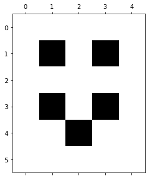
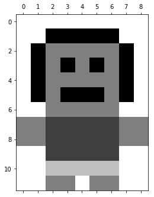

<h1>Matrices as Images</h1>

<h2>Prerequisites</h2>
<ul>
    <li>The basic concept of <a>pixels</a></li>
    <li>The <a>RGB color model</a></li>
    <li>You've seen a <a>matrix</a></li>
</ul>

<h2>Introduction</h2>

Depending on whom you ask, there are a number of different answers you will receive to the question, "What is a matrix?".  On most days, I would answer that it represents a linear transformation of a vector space.  Someone else would answer that it is convenient bookkeeping for encoding a system of equations.  Someone putting on airs might describe it as an order 2 tensor (sidenote: run away from the person who provides such an answer to a student in their first linear algebra course).  Finally, someone might describe it as a 2-dimensional grid in which we may organize information.

This final answer is, arguably, the most accurate answer (<a>Wikipedia</a> seems to agree).  But, the preceding answers aren't entirely incorrect.  Because of the sizeable utility of matrices and, as a consequence, their ubiquitity in both pure and applied math, matrices generally appear with interpretations laid on top of them.  Depending on how careful we are being, we may forget that a matrix is not necessarily the object or action that it represents.

Accepting that matrices generally come loaded with interpretations, let's follow suit and discuss matrices as a means to encode the state of a pixel in an image.  We will iterate on this idea, adding complexity as we go.  First we will develop matrices as encoding the information for a black and white image.  Then, we will extend this to a greyscale image.  And, we will finish by discussing a full-color, RGB, image.

<h2>Matrices as black and white images</h2>

To begin, let's assume that a pixel can only be either black or white.  Take the following image:


```python
import matplotlib.pyplot as plt
face = [[0,0,0,0,0],
        [0,1,0,1,0],
        [0,0,0,0,0],
        [0,1,0,1,0],
        [0,0,1,0,0],
        [0,0,0,0,0]]
plt.matshow(face, cmap='gray_r')
plt.show()
```





where we have labelled the pixel locations for easy reference.  We see that there are five black pixels and 25 white pixels. 

Because the pixels of an image form a natural grid layout, it is tempting to represent the same information numerically using a matrix:

\\[\begin{bmatrix}
0 & 0  & 0  & 0  & 0\\
0 & 1 & 0 & 1 & 0\\
0 & 0 & 0 & 0 & 0\\
0 & 1 & 0 & 1 & 0\\
0 & 0 & 1 & 0 & 0\\
0 & 0 & 0 & 0 & 0\\
\end{bmatrix}\\]

where 1 indicates a black pixel and 0 represents a white pixel.  If you needed to share this image with someone, but weren't able to show them the actual image, then this matrix would make for a reasonable stand-in. Indeed, if you squint a little, you can see that the same smily face appears in both cases.

<h2>Matrices as grayscale images</h2>

Now, let's extend this basic idea by introducing fractional values.  This time, let's begin by taking a matrix:

$$
\begin{bmatrix}
  0 &amp; 0 &amp; 0 &amp; 0 &amp; 0 &amp; 0 &amp; 0 &amp; 0 &amp; 0\\
  0 &amp; 0 &amp; 1 &amp; 1 &amp; 1 &amp; 1 &amp; 1 &amp; 0 &amp; 0\\
  0 &amp; 1 &amp; \frac{1}{2} &amp; \frac{1}{2} &amp; \frac{1}{2} &amp; \frac{1}{2} &amp; \frac{1}{2} &amp; 1 &amp; 0\\
  0 &amp; 1 &amp; \frac{1}{2} &amp; 1 &amp; \frac{1}{2} &amp; 1 &amp; \frac{1}{2} &amp; 1 &amp; 0\\
  0 &amp; 1 &amp; \frac{1}{2} &amp; \frac{1}{2} &amp; \frac{1}{2} &amp; \frac{1}{2} &amp; \frac{1}{2} &amp; 1 &amp; 0\\
  0 &amp; 1 &amp; \frac{1}{2} &amp; 1 &amp; 1 &amp; 1 &amp; \frac{1}{2} &amp; 1 &amp; 0\\
  0 &amp; 0 &amp; \frac{1}{2} &amp; \frac{1}{2} &amp; \frac{1}{2} &amp; \frac{1}{2} &amp; \frac{1}{2} &amp; 0 &amp; 0\\
  \frac{1}{2} &amp; \frac{1}{2} &amp; \frac{3}{4} &amp; \frac{3}{4} &amp; \frac{3}{4} &amp; \frac{3}{4} &amp; \frac{3}{4} &amp; \frac{1}{2} &amp; \frac{1}{2}\\
  \frac{1}{2} &amp; \frac{1}{2} &amp; \frac{3}{4} &amp; \frac{3}{4} &amp; \frac{3}{4} &amp; \frac{3}{4} &amp; \frac{3}{4} &amp; \frac{1}{2} &amp; \frac{1}{2}\\
  0 &amp; 0 &amp; \frac{3}{4} &amp; \frac{3}{4} &amp; \frac{3}{4} &amp; \frac{3}{4} &amp; \frac{3}{4} &amp; 0 &amp; 0\\
  0 &amp; 0 &amp; \frac{1}{4} &amp; \frac{1}{4} &amp; \frac{1}{4} &amp; \frac{1}{4} &amp; \frac{1}{4} &amp; 0 &amp; 0\\
  0 &amp; 0 &amp; \frac{1}{2} &amp; \frac{1}{2} &amp; 0 &amp; \frac{1}{2} &amp; \frac{1}{2} &amp; 0 &amp; 0\\
\end{bmatrix}
$$

If we choose to interpret these fractional values as greyscale (where 1 is black, 0 is white, and fractions represent an  intensity of the shade of grey), we can render the corresponding image:


```python
person = [[0,0,0,0,0,0,0,0,0],
          [0,0,1,1,1,1,1,0,0],
          [0,1,.5,.5,.5,.5,.5,1,0],
          [0,1,.5,1,.5,1,.5,1,0],
          [0,1,.5,.5,.5,.5,.5,1,0],
          [0,1,.5,1,1,1,.5,1,0],
          [0,0,.5,.5,.5,.5,.5,0,0],
          [.5,.5,.75,.75,.75,.75,.75,.5,.5],
          [.5,.5,.75,.75,.75,.75,.75,.5,.5],
          [0,0,.75,.75,.75,.75,.75,0,0],
          [0,0,.25,.25,.25,.25,.25,0,0],
          [0,0,.5,.5,0,.5,.5,0,0]]
plt.matshow(person, cmap='gray_r')
plt.show()
```





In theory, you could send someone a blank 8x11 grid and the matrix above, and they could fill in the appropriate shading.  In fact, the <a>paint-by-numbers</a> people beat us to this idea by about 70 years, simply using a less rigid grid system and a nominal classification of the colors, rather than our percentage classification of the shading.

<h2>Images in full color</h2>

Now, let's further extend this idea to a full-color, RGB, image. Consider the following image (modelled after this <a>design</a>)


```python
image_file = './images/matrices_as_images/palm.png'
palm = plt.imread(image_file) 
plt.axis('off')
plt.imshow(palm)
```


    <matplotlib.image.AxesImage at 0x7f8b25d7c908>


We have the following colors for the pixels in this image:


```python
colorscheme = [[[ .0627,  .4157,  .2510], #dark green (16,106,64)
                [ .6902,  .7412,  .3137], #light green (176,189,80)
                [ .4118,  .3098,  .2667]], #brown (105,79,68)
               [[ .4745, .3333, .2824],   #light brown (121,85,72)
                [.9882, .4941, .2510],    #orange (252,126,64)
                [.9960, .7569, .2392]],   #yellow (254,193,61)
               [[0, .4667, .7451],        #ocean blue (0,119,190)
                [.6, .8, 1],              #sky blue (153,204,255)
                [1, 1, 1]]]
plt.imshow(colorscheme)
plt.axis('off')
plt.show()
```


Each pixel, in fact, receives three pieces of information: an amount of red, green, and blue, given as a triplet (red, green, blue) with values ranging from 0 to 255.  For example, the blue of the ocean has an RGB value of (0,119,190) and the orange on the island has an RGB value of (252,126,64).  And, it should seem reasonable that the very blue color has zero red in it, whereas, the orange color has a great deal of red in it.  

To be clear, these values represent the amount of, say, red that a pixel should recieve.  So, 0 indicates that it should receive no red and 255 indicates full red.  Ultimately, this is another way of representing fractional values.  We could, in fact, normalize these values to be between 0 and 1, like we did with the greyscale example above.  For example, a value of 85 in the range [0,255] is equivalent to the value of $\frac{1}{3}$ in the range [0,1].  The choice is somewhat arbitrary (some color classification websites will give you <a>both</a>, along with a number of other systems for representing colors), but below we will see that the integer values do make the matrix representation easier to read.

We can reframe this slightly: because every pixel receives red, green, and blue information, we can discuss the amount of, say, red that is passed into all of the pixels separately from the other colors.  And, we can represent this as a, fairly large, matrix, where each entry indicates the amount of red in each corresponding pixel of the image.


$$
\begin{bmatrix}
  153 &amp; 153 &amp; 153 &amp; 153 &amp; 153 &amp; 153 &amp; 153 &amp; 153 &amp; 153 &amp; 153 &amp; 153 &amp; 153 &amp; 153 &amp; 153 &amp; 153 &amp; 153\\
  153 &amp; 153 &amp; 153 &amp; 153 &amp; 153 &amp; 153 &amp; 153 &amp; 153 &amp; 153 &amp; 153 &amp; 153 &amp; 153 &amp; 153 &amp; 153 &amp; 153 &amp; 153\\
  153 &amp; 153 &amp; 153 &amp; 153 &amp; 153 &amp; 153 &amp; 153 &amp; 153 &amp; 153 &amp; 153 &amp; 153 &amp; 153 &amp; 153 &amp; 153 &amp; 153 &amp; 153\\
  153 &amp; 153 &amp; 153 &amp; 153 &amp; 153 &amp; 153 &amp; 153 &amp; 153 &amp; 153 &amp; 153 &amp; 153 &amp; 153 &amp; 153 &amp; 153 &amp; 153 &amp; 153\\
  153 &amp; 153 &amp; 153 &amp; 153 &amp; 153 &amp; 153 &amp; 153 &amp; 153 &amp; 153 &amp; 153 &amp; 153 &amp; 153 &amp; 16 &amp; 176 &amp; 153 &amp; 153\\
  153 &amp; 153 &amp; 153 &amp; 176 &amp; 16 &amp; 153 &amp; 153 &amp; 16 &amp; 16 &amp; 153 &amp; 153 &amp; 16 &amp; 176 &amp; 153 &amp; 153 &amp; 153\\
  153 &amp; 153 &amp; 176 &amp; 16 &amp; 153 &amp; 153 &amp; 153 &amp; 176 &amp; 176 &amp; 16 &amp; 16 &amp; 16 &amp; 176 &amp; 153 &amp; 153 &amp; 153\\
  153 &amp; 153 &amp; 176 &amp; 16 &amp; 153 &amp; 176 &amp; 16 &amp; 153 &amp; 153 &amp; 176 &amp; 176 &amp; 176 &amp; 16 &amp; 16 &amp; 16 &amp; 153\\
  153 &amp; 153 &amp; 176 &amp; 16 &amp; 176 &amp; 16 &amp; 153 &amp; 176 &amp; 176 &amp; 16 &amp; 16 &amp; 176 &amp; 176 &amp; 16 &amp; 176 &amp; 16\\
  153 &amp; 16 &amp; 16 &amp; 176 &amp; 16 &amp; 153 &amp; 153 &amp; 16 &amp; 16 &amp; 153 &amp; 105 &amp; 105 &amp; 16 &amp; 176 &amp; 16 &amp; 153\\
  16 &amp; 176 &amp; 176 &amp; 16 &amp; 176 &amp; 105 &amp; 153 &amp; 153 &amp; 153 &amp; 153 &amp; 121 &amp; 105 &amp; 16 &amp; 176 &amp; 16 &amp; 153\\
  16 &amp; 153 &amp; 176 &amp; 16 &amp; 176 &amp; 105 &amp; 121 &amp; 153 &amp; 153 &amp; 105 &amp; 105 &amp; 121 &amp; 153 &amp; 176 &amp; 16 &amp; 153\\
  153 &amp; 153 &amp; 16 &amp; 176 &amp; 153 &amp; 153 &amp; 105 &amp; 105 &amp; 153 &amp; 121 &amp; 105 &amp; 153 &amp; 153 &amp; 153 &amp; 153 &amp; 153\\
  153 &amp; 153 &amp; 16 &amp; 176 &amp; 153 &amp; 153 &amp; 153 &amp; 121 &amp; 105 &amp; 105 &amp; 121 &amp; 153 &amp; 153 &amp; 153 &amp; 153 &amp; 153\\
  153 &amp; 153 &amp; 153 &amp; 153 &amp; 153 &amp; 153 &amp; 153 &amp; 105 &amp; 121 &amp; 105 &amp; 105 &amp; 153 &amp; 153 &amp; 153 &amp; 153 &amp; 153\\
  0 &amp; 0 &amp; 0 &amp; 0 &amp; 0 &amp; 0 &amp; 0 &amp; 0 &amp; 105 &amp; 121 &amp; 0 &amp; 0 &amp; 0 &amp; 0 &amp; 0 &amp; 0\\
  0 &amp; 0 &amp; 0 &amp; 0 &amp; 0 &amp; 254 &amp; 254 &amp; 254 &amp; 105 &amp; 105 &amp; 254 &amp; 254 &amp; 0 &amp; 0 &amp; 0 &amp; 0\\
  0 &amp; 0 &amp; 0 &amp; 0 &amp; 254 &amp; 254 &amp; 254 &amp; 254 &amp; 121 &amp; 105 &amp; 254 &amp; 254 &amp; 254 &amp; 253 &amp; 0 &amp; 0\\
  0 &amp; 0 &amp; 0 &amp; 0 &amp; 253 &amp; 253 &amp; 254 &amp; 254 &amp; 254 &amp; 254 &amp; 254 &amp; 254 &amp; 253 &amp; 253 &amp; 0 &amp; 0\\
  0 &amp; 0 &amp; 0 &amp; 0 &amp; 0 &amp; 253 &amp; 253 &amp; 253 &amp; 253 &amp; 253 &amp; 253 &amp; 253 &amp; 253 &amp; 0 &amp; 0 &amp; 0\\
\end{bmatrix}
$$

Note how the pixels corresponding to the ocean have a red value of zero, as we would expect.

Similarly, we can isolate the green information: 
$$
\begin{bmatrix}
  204 &amp; 204 &amp; 204 &amp; 204 &amp; 204 &amp; 204 &amp; 204 &amp; 204 &amp; 204 &amp; 204 &amp; 204 &amp; 204 &amp; 204 &amp; 204 &amp; 204 &amp; 204\\
  204 &amp; 204 &amp; 204 &amp; 204 &amp; 204 &amp; 204 &amp; 204 &amp; 204 &amp; 204 &amp; 204 &amp; 204 &amp; 204 &amp; 204 &amp; 204 &amp; 204 &amp; 204\\
  204 &amp; 204 &amp; 204 &amp; 204 &amp; 204 &amp; 204 &amp; 204 &amp; 204 &amp; 204 &amp; 204 &amp; 204 &amp; 204 &amp; 204 &amp; 204 &amp; 204 &amp; 204\\
  204 &amp; 204 &amp; 204 &amp; 204 &amp; 204 &amp; 204 &amp; 204 &amp; 204 &amp; 204 &amp; 204 &amp; 204 &amp; 204 &amp; 204 &amp; 204 &amp; 204 &amp; 204\\
  204 &amp; 204 &amp; 204 &amp; 204 &amp; 204 &amp; 204 &amp; 204 &amp; 204 &amp; 204 &amp; 204 &amp; 204 &amp; 204 &amp; 106 &amp; 189 &amp; 204 &amp; 204\\
  204 &amp; 204 &amp; 204 &amp; 189 &amp; 106 &amp; 204 &amp; 204 &amp; 106 &amp; 106 &amp; 204 &amp; 204 &amp; 106 &amp; 189 &amp; 204 &amp; 204 &amp; 204\\
  204 &amp; 204 &amp; 189 &amp; 106 &amp; 204 &amp; 204 &amp; 204 &amp; 189 &amp; 189 &amp; 106 &amp; 106 &amp; 106 &amp; 189 &amp; 204 &amp; 204 &amp; 204\\
  204 &amp; 204 &amp; 189 &amp; 106 &amp; 204 &amp; 189 &amp; 106 &amp; 204 &amp; 204 &amp; 189 &amp; 189 &amp; 189 &amp; 106 &amp; 106 &amp; 106 &amp; 204\\
  204 &amp; 204 &amp; 189 &amp; 106 &amp; 189 &amp; 106 &amp; 204 &amp; 189 &amp; 189 &amp; 106 &amp; 106 &amp; 189 &amp; 189 &amp; 106 &amp; 189 &amp; 106\\
  204 &amp; 106 &amp; 106 &amp; 189 &amp; 106 &amp; 204 &amp; 204 &amp; 106 &amp; 106 &amp; 204 &amp; 79 &amp; 79 &amp; 106 &amp; 189 &amp; 106 &amp; 204\\
  106 &amp; 189 &amp; 189 &amp; 106 &amp; 189 &amp; 79 &amp; 204 &amp; 204 &amp; 204 &amp; 204 &amp; 85 &amp; 79 &amp; 106 &amp; 189 &amp; 106 &amp; 204\\
  106 &amp; 204 &amp; 189 &amp; 106 &amp; 189 &amp; 79 &amp; 85 &amp; 204 &amp; 204 &amp; 79 &amp; 79 &amp; 85 &amp; 204 &amp; 189 &amp; 106 &amp; 204\\
  204 &amp; 204 &amp; 106 &amp; 189 &amp; 204 &amp; 204 &amp; 79 &amp; 79 &amp; 204 &amp; 85 &amp; 79 &amp; 204 &amp; 204 &amp; 204 &amp; 204 &amp; 204\\
  204 &amp; 204 &amp; 106 &amp; 189 &amp; 204 &amp; 204 &amp; 204 &amp; 85 &amp; 79 &amp; 79 &amp; 85 &amp; 204 &amp; 204 &amp; 204 &amp; 204 &amp; 204\\
  204 &amp; 204 &amp; 204 &amp; 204 &amp; 204 &amp; 204 &amp; 204 &amp; 79 &amp; 85 &amp; 79 &amp; 79 &amp; 204 &amp; 204 &amp; 204 &amp; 204 &amp; 204\\
  120 &amp; 120 &amp; 120 &amp; 120 &amp; 120 &amp; 120 &amp; 120 &amp; 120 &amp; 79 &amp; 85 &amp; 120 &amp; 120 &amp; 120 &amp; 120 &amp; 120 &amp; 120\\
  120 &amp; 120 &amp; 120 &amp; 120 &amp; 120 &amp; 193 &amp; 193 &amp; 193 &amp; 79 &amp; 79 &amp; 193 &amp; 193 &amp; 120 &amp; 120 &amp; 120 &amp; 120\\
  120 &amp; 120 &amp; 120 &amp; 120 &amp; 193 &amp; 193 &amp; 193 &amp; 193 &amp; 85 &amp; 79 &amp; 193 &amp; 193 &amp; 193 &amp; 127 &amp; 120 &amp; 120\\
  120 &amp; 120 &amp; 120 &amp; 120 &amp; 127 &amp; 127 &amp; 193 &amp; 193 &amp; 193 &amp; 193 &amp; 193 &amp; 193 &amp; 127 &amp; 127 &amp; 120 &amp; 120\\
  120 &amp; 120 &amp; 120 &amp; 120 &amp; 120 &amp; 127 &amp; 127 &amp; 127 &amp; 127 &amp; 127 &amp; 127 &amp; 127 &amp; 127 &amp; 120 &amp; 120 &amp; 120\\
\end{bmatrix}
$$

And the blue information:

$$
\begin{bmatrix}
  255 &amp; 255 &amp; 255 &amp; 255 &amp; 255 &amp; 255 &amp; 255 &amp; 255 &amp; 255 &amp; 255 &amp; 255 &amp; 255 &amp; 255 &amp; 255 &amp; 255 &amp; 255\\
  255 &amp; 255 &amp; 255 &amp; 255 &amp; 255 &amp; 255 &amp; 255 &amp; 255 &amp; 255 &amp; 255 &amp; 255 &amp; 255 &amp; 255 &amp; 255 &amp; 255 &amp; 255\\
  255 &amp; 255 &amp; 255 &amp; 255 &amp; 255 &amp; 255 &amp; 255 &amp; 255 &amp; 255 &amp; 255 &amp; 255 &amp; 255 &amp; 255 &amp; 255 &amp; 255 &amp; 255\\
  255 &amp; 255 &amp; 255 &amp; 255 &amp; 255 &amp; 255 &amp; 255 &amp; 255 &amp; 255 &amp; 255 &amp; 255 &amp; 255 &amp; 255 &amp; 255 &amp; 255 &amp; 255\\
  255 &amp; 255 &amp; 255 &amp; 255 &amp; 255 &amp; 255 &amp; 255 &amp; 255 &amp; 255 &amp; 255 &amp; 255 &amp; 255 &amp; 64 &amp; 80 &amp; 255 &amp; 255\\
  255 &amp; 255 &amp; 255 &amp; 80 &amp; 64 &amp; 255 &amp; 255 &amp; 64 &amp; 64 &amp; 255 &amp; 255 &amp; 64 &amp; 80 &amp; 255 &amp; 255 &amp; 255\\
  255 &amp; 255 &amp; 80 &amp; 64 &amp; 255 &amp; 255 &amp; 255 &amp; 80 &amp; 80 &amp; 64 &amp; 64 &amp; 64 &amp; 80 &amp; 255 &amp; 255 &amp; 255\\
  255 &amp; 255 &amp; 80 &amp; 64 &amp; 255 &amp; 80 &amp; 64 &amp; 255 &amp; 255 &amp; 80 &amp; 80 &amp; 80 &amp; 64 &amp; 64 &amp; 64 &amp; 255\\
  255 &amp; 255 &amp; 80 &amp; 64 &amp; 80 &amp; 64 &amp; 255 &amp; 80 &amp; 80 &amp; 64 &amp; 64 &amp; 80 &amp; 80 &amp; 64 &amp; 80 &amp; 64\\
  255 &amp; 64 &amp; 64 &amp; 80 &amp; 64 &amp; 255 &amp; 255 &amp; 64 &amp; 64 &amp; 255 &amp; 68 &amp; 68 &amp; 64 &amp; 80 &amp; 64 &amp; 255\\
  64 &amp; 80 &amp; 80 &amp; 64 &amp; 80 &amp; 68 &amp; 255 &amp; 255 &amp; 255 &amp; 255 &amp; 72 &amp; 68 &amp; 64 &amp; 80 &amp; 64 &amp; 255\\
  64 &amp; 255 &amp; 80 &amp; 64 &amp; 80 &amp; 68 &amp; 72 &amp; 255 &amp; 255 &amp; 68 &amp; 68 &amp; 72 &amp; 255 &amp; 80 &amp; 64 &amp; 255\\
  255 &amp; 255 &amp; 64 &amp; 80 &amp; 255 &amp; 255 &amp; 68 &amp; 68 &amp; 255 &amp; 72 &amp; 68 &amp; 255 &amp; 255 &amp; 255 &amp; 255 &amp; 255\\
  255 &amp; 255 &amp; 64 &amp; 80 &amp; 255 &amp; 255 &amp; 255 &amp; 72 &amp; 68 &amp; 68 &amp; 72 &amp; 255 &amp; 255 &amp; 255 &amp; 255 &amp; 255\\
  255 &amp; 255 &amp; 255 &amp; 255 &amp; 255 &amp; 255 &amp; 255 &amp; 68 &amp; 72 &amp; 68 &amp; 68 &amp; 255 &amp; 255 &amp; 255 &amp; 255 &amp; 255\\
  190 &amp; 190 &amp; 190 &amp; 190 &amp; 190 &amp; 190 &amp; 190 &amp; 190 &amp; 68 &amp; 72 &amp; 190 &amp; 190 &amp; 190 &amp; 190 &amp; 190 &amp; 190\\
  190 &amp; 190 &amp; 190 &amp; 190 &amp; 190 &amp; 61 &amp; 61 &amp; 61 &amp; 68 &amp; 68 &amp; 61 &amp; 61 &amp; 190 &amp; 190 &amp; 190 &amp; 190\\
  190 &amp; 190 &amp; 190 &amp; 190 &amp; 61 &amp; 61 &amp; 61 &amp; 61 &amp; 72 &amp; 68 &amp; 61 &amp; 61 &amp; 61 &amp; 64 &amp; 190 &amp; 190\\
  190 &amp; 190 &amp; 190 &amp; 190 &amp; 64 &amp; 64 &amp; 61 &amp; 61 &amp; 61 &amp; 61 &amp; 61 &amp; 61 &amp; 64 &amp; 64 &amp; 190 &amp; 190\\
  190 &amp; 190 &amp; 190 &amp; 190 &amp; 190 &amp; 64 &amp; 64 &amp; 64 &amp; 64 &amp; 64 &amp; 64 &amp; 64 &amp; 64 &amp; 190 &amp; 190 &amp; 190\\
\end{bmatrix}
$$

Indeed, based on these matrices, we could represent 3 versions of the image, one for each color:


```python
fig = plt.figure(figsize=(15, 12))

ax1 = fig.add_subplot(1,3,1)    
ax2 = fig.add_subplot(1,3,2)
ax3 = fig.add_subplot(1,3,3)

ax1.imshow(palm_rgb['red'], cmap='Reds')
ax2.imshow(palm_rgb['green'], cmap='Greens')
ax3.imshow(palm_rgb['blue'], cmap='Blues')
ax1.axis('off')
ax2.axis('off')
ax3.axis('off')

plt.show()
```


And, a nice way to conceptualize the final image is to imagine laying each of these colored sheets on top of each other, so that the colors blend together.  Because the dimensions of the red, green, and blue matrices all agree, we can be confident that every pixel will receive red, green, and blue information.

The details of the digital image processing are a little too far afield for this article (but certainly accessible with sufficient curiosity; <a>these lectures</a> and <a>this tutorial</a> seem like reasonable starting points), as are the technical details of how one can "glue" the corresponding matrices together.  As an introduction, some intuition on how matrices can encode information was our true goal here, and we can leave some mysteries for another day.

<h2>Closing Thoughts</h2>

As we have demonstrated, we can use matrices to encode the state of a pixel within an image, in part because both the grouping of pixels and the format of matrices adhere to a 2-dimensional grid layout.  It is important to note that matrices do not intrinsically represent pixel information.  Rather, we laid this interpretation on top of them and used it to our advantage.  Further, the interpretation we developed here is no more fundamental nor of more general value than any of the others that we will develop. I suppose, matrices themselves are not terribly interesting.  But, we can breathe some life into them by placing them inside a narrative structure, and we can leverage their strengths to make our ideas more tangible and organized.  Perhaps this is rather analogous to how the letters of our alphabet are somewhat arbitrary and only become interesting when we give them utility and life through the stories we share.  I encourage you to begin to view math less as a museum of esoteric and detached symbols, and to look instead to the flow of ideas that happen to utilize an economy of notation. 

<h2>Appendix: Tools Used</h2>

This section contains some of the programming tools that I have used to create the above results, and avoid the tedium of typing everything by hand.  Because these do not provide insight into the linear algebra topic at hand, they deserve to be relegated to an appendix, while being retained for the curious.

Latex matrices aren't enjoyable to type, so we define here a function to convert a matrix array into the appropriate string:


```python
import numpy as np

#feed in a numpy array and format to latex bmatrix
def latex_matrix(array):
    rows = str(array).replace('[', '').replace(']', '').replace('0.5','\\frac{1}{2}').replace('0.75','\\frac{3}{4}').replace('0.25','\\frac{1}{4}').replace('.','').splitlines()
    result = ['\\begin{bmatrix}']
    result += ['  ' + ' & '.join(row.split()) + '\\\\' for row in rows]
    result +=  ['\\end{bmatrix}']
    return '\n'.join(result)
```


```python
numpyPerson = np.array([[0,0,0,0,0,0,0,0,0],
          [0,0,1,1,1,1,1,0,0],
          [0,1,.5,.5,.5,.5,.5,1,0],
          [0,1,.5,1,.5,1,.5,1,0],
          [0,1,.5,.5,.5,.5,.5,1,0],
          [0,1,.5,1,1,1,.5,1,0],
          [0,0,.5,.5,.5,.5,.5,0,0],
          [.5,.5,.75,.75,.75,.75,.75,.5,.5],
          [.5,.5,.75,.75,.75,.75,.75,.5,.5],
          [0,0,.75,.75,.75,.75,.75,0,0],
          [0,0,.25,.25,.25,.25,.25,0,0],
          [0,0,.5,.5,0,.5,.5,0,0]])
a = latex_matrix(numpyPerson)
print(a)
```

    \begin{bmatrix}
      0 & 0 & 0 & 0 & 0 & 0 & 0 & 0 & 0\\
      0 & 0 & 1 & 1 & 1 & 1 & 1 & 0 & 0\\
      0 & 1 & \frac{1}{2} & \frac{1}{2} & \frac{1}{2} & \frac{1}{2} & \frac{1}{2} & 1 & 0\\
      0 & 1 & \frac{1}{2} & 1 & \frac{1}{2} & 1 & \frac{1}{2} & 1 & 0\\
      0 & 1 & \frac{1}{2} & \frac{1}{2} & \frac{1}{2} & \frac{1}{2} & \frac{1}{2} & 1 & 0\\
      0 & 1 & \frac{1}{2} & 1 & 1 & 1 & \frac{1}{2} & 1 & 0\\
      0 & 0 & \frac{1}{2} & \frac{1}{2} & \frac{1}{2} & \frac{1}{2} & \frac{1}{2} & 0 & 0\\
      \frac{1}{2} & \frac{1}{2} & \frac{3}{4} & \frac{3}{4} & \frac{3}{4} & \frac{3}{4} & \frac{3}{4} & \frac{1}{2} & \frac{1}{2}\\
      \frac{1}{2} & \frac{1}{2} & \frac{3}{4} & \frac{3}{4} & \frac{3}{4} & \frac{3}{4} & \frac{3}{4} & \frac{1}{2} & \frac{1}{2}\\
      0 & 0 & \frac{3}{4} & \frac{3}{4} & \frac{3}{4} & \frac{3}{4} & \frac{3}{4} & 0 & 0\\
      0 & 0 & \frac{1}{4} & \frac{1}{4} & \frac{1}{4} & \frac{1}{4} & \frac{1}{4} & 0 & 0\\
      0 & 0 & \frac{1}{2} & \frac{1}{2} & 0 & \frac{1}{2} & \frac{1}{2} & 0 & 0\\
    \end{bmatrix}


I created the palm image in <a>Pixilart</a>.  Rather than manually populating the RGB value array, I imported this image file into the appropriate array, "palm".


```python
print(palm)
```

    [[[0.6        0.8        1.         1.        ]
      [0.6        0.8        1.         1.        ]
      [0.6        0.8        1.         1.        ]
      ...
      [0.6        0.8        1.         1.        ]
      [0.6        0.8        1.         1.        ]
      [0.6        0.8        1.         1.        ]]
    
     [[0.6        0.8        1.         1.        ]
      [0.6        0.8        1.         1.        ]
      [0.6        0.8        1.         1.        ]
      ...
      [0.6        0.8        1.         1.        ]
      [0.6        0.8        1.         1.        ]
      [0.6        0.8        1.         1.        ]]
    
     [[0.6        0.8        1.         1.        ]
      [0.6        0.8        1.         1.        ]
      [0.6        0.8        1.         1.        ]
      ...
      [0.6        0.8        1.         1.        ]
      [0.6        0.8        1.         1.        ]
      [0.6        0.8        1.         1.        ]]
    
     ...
    
     [[0.         0.47058824 0.74509805 1.        ]
      [0.         0.47058824 0.74509805 1.        ]
      [0.         0.47058824 0.74509805 1.        ]
      ...
      [0.99215686 0.49803922 0.2509804  1.        ]
      [0.         0.47058824 0.74509805 1.        ]
      [0.         0.47058824 0.74509805 1.        ]]
    
     [[0.         0.47058824 0.74509805 1.        ]
      [0.         0.47058824 0.74509805 1.        ]
      [0.         0.47058824 0.74509805 1.        ]
      ...
      [0.99215686 0.49803922 0.2509804  1.        ]
      [0.         0.47058824 0.74509805 1.        ]
      [0.         0.47058824 0.74509805 1.        ]]
    
     [[0.         0.47058824 0.74509805 1.        ]
      [0.         0.47058824 0.74509805 1.        ]
      [0.         0.47058824 0.74509805 1.        ]
      ...
      [0.         0.47058824 0.74509805 1.        ]
      [0.         0.47058824 0.74509805 1.        ]
      [0.         0.47058824 0.74509805 1.        ]]]


This produces a RGBA vector for each pixel (where the 4th element represents opacity).  I need a function that will extract the respective color values and populate 3 separate matrices (I don't need the opacity information for the above discussion).

I imagine there is a built-in to accomplish this, but the logic is simple enough that I will hardcode it for now.


```python
def rgb_extractor(array):
    result = {}
    red_matrix = []
    green_matrix = []
    blue_matrix = []
    for row in array:
        row_red = []
        row_green = []
        row_blue = []
        for pixel in row:
            row_red.append(pixel[0])
            row_green.append(pixel[1])
            row_blue.append(pixel[2])
        
        red_matrix.append(row_red)
        green_matrix.append(row_green)
        blue_matrix.append(row_blue)
        
    result['red'] = red_matrix
    result['green'] = green_matrix
    result['blue'] = blue_matrix
    
    return result

palm_rgb = rgb_extractor(palm)

#just to check desired outcome
print(palm_rgb['red'])
            
```

    [[0.6, 0.6, 0.6, 0.6, 0.6, 0.6, 0.6, 0.6, 0.6, 0.6, 0.6, 0.6, 0.6, 0.6, 0.6, 0.6], [0.6, 0.6, 0.6, 0.6, 0.6, 0.6, 0.6, 0.6, 0.6, 0.6, 0.6, 0.6, 0.6, 0.6, 0.6, 0.6], [0.6, 0.6, 0.6, 0.6, 0.6, 0.6, 0.6, 0.6, 0.6, 0.6, 0.6, 0.6, 0.6, 0.6, 0.6, 0.6], [0.6, 0.6, 0.6, 0.6, 0.6, 0.6, 0.6, 0.6, 0.6, 0.6, 0.6, 0.6, 0.6, 0.6, 0.6, 0.6], [0.6, 0.6, 0.6, 0.6, 0.6, 0.6, 0.6, 0.6, 0.6, 0.6, 0.6, 0.6, 0.0627451, 0.6901961, 0.6, 0.6], [0.6, 0.6, 0.6, 0.6901961, 0.0627451, 0.6, 0.6, 0.0627451, 0.0627451, 0.6, 0.6, 0.0627451, 0.6901961, 0.6, 0.6, 0.6], [0.6, 0.6, 0.6901961, 0.0627451, 0.6, 0.6, 0.6, 0.6901961, 0.6901961, 0.0627451, 0.0627451, 0.0627451, 0.6901961, 0.6, 0.6, 0.6], [0.6, 0.6, 0.6901961, 0.0627451, 0.6, 0.6901961, 0.0627451, 0.6, 0.6, 0.6901961, 0.6901961, 0.6901961, 0.0627451, 0.0627451, 0.0627451, 0.6], [0.6, 0.6, 0.6901961, 0.0627451, 0.6901961, 0.0627451, 0.6, 0.6901961, 0.6901961, 0.0627451, 0.0627451, 0.6901961, 0.6901961, 0.0627451, 0.6901961, 0.0627451], [0.6, 0.0627451, 0.0627451, 0.6901961, 0.0627451, 0.6, 0.6, 0.0627451, 0.0627451, 0.6, 0.4117647, 0.4117647, 0.0627451, 0.6901961, 0.0627451, 0.6], [0.0627451, 0.6901961, 0.6901961, 0.0627451, 0.6901961, 0.4117647, 0.6, 0.6, 0.6, 0.6, 0.4745098, 0.4117647, 0.0627451, 0.6901961, 0.0627451, 0.6], [0.0627451, 0.6, 0.6901961, 0.0627451, 0.6901961, 0.4117647, 0.4745098, 0.6, 0.6, 0.4117647, 0.4117647, 0.4745098, 0.6, 0.6901961, 0.0627451, 0.6], [0.6, 0.6, 0.0627451, 0.6901961, 0.6, 0.6, 0.4117647, 0.4117647, 0.6, 0.4745098, 0.4117647, 0.6, 0.6, 0.6, 0.6, 0.6], [0.6, 0.6, 0.0627451, 0.6901961, 0.6, 0.6, 0.6, 0.4745098, 0.4117647, 0.4117647, 0.4745098, 0.6, 0.6, 0.6, 0.6, 0.6], [0.6, 0.6, 0.6, 0.6, 0.6, 0.6, 0.6, 0.4117647, 0.4745098, 0.4117647, 0.4117647, 0.6, 0.6, 0.6, 0.6, 0.6], [0.0, 0.0, 0.0, 0.0, 0.0, 0.0, 0.0, 0.0, 0.4117647, 0.4745098, 0.0, 0.0, 0.0, 0.0, 0.0, 0.0], [0.0, 0.0, 0.0, 0.0, 0.0, 0.99607843, 0.99607843, 0.99607843, 0.4117647, 0.4117647, 0.99607843, 0.99607843, 0.0, 0.0, 0.0, 0.0], [0.0, 0.0, 0.0, 0.0, 0.99607843, 0.99607843, 0.99607843, 0.99607843, 0.4745098, 0.4117647, 0.99607843, 0.99607843, 0.99607843, 0.99215686, 0.0, 0.0], [0.0, 0.0, 0.0, 0.0, 0.99215686, 0.99215686, 0.99607843, 0.99607843, 0.99607843, 0.99607843, 0.99607843, 0.99607843, 0.99215686, 0.99215686, 0.0, 0.0], [0.0, 0.0, 0.0, 0.0, 0.0, 0.99215686, 0.99215686, 0.99215686, 0.99215686, 0.99215686, 0.99215686, 0.99215686, 0.99215686, 0.0, 0.0, 0.0]]


These are suitable for the plotting above, but I also want to convert these to a form suitable for the matrix rendering:


```python
import math

palm_red_int = [[math.floor(x*255) for x in layer1] for layer1 in palm_rgb['red']]
palm_green_int = [[math.floor(x*255) for x in layer1] for layer1 in palm_rgb['green']]
palm_blue_int = [[math.floor(x*255) for x in layer1] for layer1 in palm_rgb['blue']]
```


```python
palm_red_matrix = np.array(palm_red_int)
tempRed = latex_matrix(palm_red_matrix)
print(tempRed)
```

    \begin{bmatrix}
      153 & 153 & 153 & 153 & 153 & 153 & 153 & 153 & 153 & 153 & 153 & 153 & 153 & 153 & 153 & 153\\
      153 & 153 & 153 & 153 & 153 & 153 & 153 & 153 & 153 & 153 & 153 & 153 & 153 & 153 & 153 & 153\\
      153 & 153 & 153 & 153 & 153 & 153 & 153 & 153 & 153 & 153 & 153 & 153 & 153 & 153 & 153 & 153\\
      153 & 153 & 153 & 153 & 153 & 153 & 153 & 153 & 153 & 153 & 153 & 153 & 153 & 153 & 153 & 153\\
      153 & 153 & 153 & 153 & 153 & 153 & 153 & 153 & 153 & 153 & 153 & 153 & 16 & 176 & 153 & 153\\
      153 & 153 & 153 & 176 & 16 & 153 & 153 & 16 & 16 & 153 & 153 & 16 & 176 & 153 & 153 & 153\\
      153 & 153 & 176 & 16 & 153 & 153 & 153 & 176 & 176 & 16 & 16 & 16 & 176 & 153 & 153 & 153\\
      153 & 153 & 176 & 16 & 153 & 176 & 16 & 153 & 153 & 176 & 176 & 176 & 16 & 16 & 16 & 153\\
      153 & 153 & 176 & 16 & 176 & 16 & 153 & 176 & 176 & 16 & 16 & 176 & 176 & 16 & 176 & 16\\
      153 & 16 & 16 & 176 & 16 & 153 & 153 & 16 & 16 & 153 & 105 & 105 & 16 & 176 & 16 & 153\\
      16 & 176 & 176 & 16 & 176 & 105 & 153 & 153 & 153 & 153 & 121 & 105 & 16 & 176 & 16 & 153\\
      16 & 153 & 176 & 16 & 176 & 105 & 121 & 153 & 153 & 105 & 105 & 121 & 153 & 176 & 16 & 153\\
      153 & 153 & 16 & 176 & 153 & 153 & 105 & 105 & 153 & 121 & 105 & 153 & 153 & 153 & 153 & 153\\
      153 & 153 & 16 & 176 & 153 & 153 & 153 & 121 & 105 & 105 & 121 & 153 & 153 & 153 & 153 & 153\\
      153 & 153 & 153 & 153 & 153 & 153 & 153 & 105 & 121 & 105 & 105 & 153 & 153 & 153 & 153 & 153\\
      0 & 0 & 0 & 0 & 0 & 0 & 0 & 0 & 105 & 121 & 0 & 0 & 0 & 0 & 0 & 0\\
      0 & 0 & 0 & 0 & 0 & 254 & 254 & 254 & 105 & 105 & 254 & 254 & 0 & 0 & 0 & 0\\
      0 & 0 & 0 & 0 & 254 & 254 & 254 & 254 & 121 & 105 & 254 & 254 & 254 & 253 & 0 & 0\\
      0 & 0 & 0 & 0 & 253 & 253 & 254 & 254 & 254 & 254 & 254 & 254 & 253 & 253 & 0 & 0\\
      0 & 0 & 0 & 0 & 0 & 253 & 253 & 253 & 253 & 253 & 253 & 253 & 253 & 0 & 0 & 0\\
    \end{bmatrix}


```python
palm_green_matrix = np.array(palm_green_int)
tempGreen = latex_matrix(palm_green_matrix)
print(tempGreen)
```

    \begin{bmatrix}
      204 & 204 & 204 & 204 & 204 & 204 & 204 & 204 & 204 & 204 & 204 & 204 & 204 & 204 & 204 & 204\\
      204 & 204 & 204 & 204 & 204 & 204 & 204 & 204 & 204 & 204 & 204 & 204 & 204 & 204 & 204 & 204\\
      204 & 204 & 204 & 204 & 204 & 204 & 204 & 204 & 204 & 204 & 204 & 204 & 204 & 204 & 204 & 204\\
      204 & 204 & 204 & 204 & 204 & 204 & 204 & 204 & 204 & 204 & 204 & 204 & 204 & 204 & 204 & 204\\
      204 & 204 & 204 & 204 & 204 & 204 & 204 & 204 & 204 & 204 & 204 & 204 & 106 & 189 & 204 & 204\\
      204 & 204 & 204 & 189 & 106 & 204 & 204 & 106 & 106 & 204 & 204 & 106 & 189 & 204 & 204 & 204\\
      204 & 204 & 189 & 106 & 204 & 204 & 204 & 189 & 189 & 106 & 106 & 106 & 189 & 204 & 204 & 204\\
      204 & 204 & 189 & 106 & 204 & 189 & 106 & 204 & 204 & 189 & 189 & 189 & 106 & 106 & 106 & 204\\
      204 & 204 & 189 & 106 & 189 & 106 & 204 & 189 & 189 & 106 & 106 & 189 & 189 & 106 & 189 & 106\\
      204 & 106 & 106 & 189 & 106 & 204 & 204 & 106 & 106 & 204 & 79 & 79 & 106 & 189 & 106 & 204\\
      106 & 189 & 189 & 106 & 189 & 79 & 204 & 204 & 204 & 204 & 85 & 79 & 106 & 189 & 106 & 204\\
      106 & 204 & 189 & 106 & 189 & 79 & 85 & 204 & 204 & 79 & 79 & 85 & 204 & 189 & 106 & 204\\
      204 & 204 & 106 & 189 & 204 & 204 & 79 & 79 & 204 & 85 & 79 & 204 & 204 & 204 & 204 & 204\\
      204 & 204 & 106 & 189 & 204 & 204 & 204 & 85 & 79 & 79 & 85 & 204 & 204 & 204 & 204 & 204\\
      204 & 204 & 204 & 204 & 204 & 204 & 204 & 79 & 85 & 79 & 79 & 204 & 204 & 204 & 204 & 204\\
      120 & 120 & 120 & 120 & 120 & 120 & 120 & 120 & 79 & 85 & 120 & 120 & 120 & 120 & 120 & 120\\
      120 & 120 & 120 & 120 & 120 & 193 & 193 & 193 & 79 & 79 & 193 & 193 & 120 & 120 & 120 & 120\\
      120 & 120 & 120 & 120 & 193 & 193 & 193 & 193 & 85 & 79 & 193 & 193 & 193 & 127 & 120 & 120\\
      120 & 120 & 120 & 120 & 127 & 127 & 193 & 193 & 193 & 193 & 193 & 193 & 127 & 127 & 120 & 120\\
      120 & 120 & 120 & 120 & 120 & 127 & 127 & 127 & 127 & 127 & 127 & 127 & 127 & 120 & 120 & 120\\
    \end{bmatrix}


```python
palm_blue_matrix = np.array(palm_blue_int)
tempBlue = latex_matrix(palm_blue_matrix)
print(tempBlue)
```

    \begin{bmatrix}
      255 & 255 & 255 & 255 & 255 & 255 & 255 & 255 & 255 & 255 & 255 & 255 & 255 & 255 & 255 & 255\\
      255 & 255 & 255 & 255 & 255 & 255 & 255 & 255 & 255 & 255 & 255 & 255 & 255 & 255 & 255 & 255\\
      255 & 255 & 255 & 255 & 255 & 255 & 255 & 255 & 255 & 255 & 255 & 255 & 255 & 255 & 255 & 255\\
      255 & 255 & 255 & 255 & 255 & 255 & 255 & 255 & 255 & 255 & 255 & 255 & 255 & 255 & 255 & 255\\
      255 & 255 & 255 & 255 & 255 & 255 & 255 & 255 & 255 & 255 & 255 & 255 & 64 & 80 & 255 & 255\\
      255 & 255 & 255 & 80 & 64 & 255 & 255 & 64 & 64 & 255 & 255 & 64 & 80 & 255 & 255 & 255\\
      255 & 255 & 80 & 64 & 255 & 255 & 255 & 80 & 80 & 64 & 64 & 64 & 80 & 255 & 255 & 255\\
      255 & 255 & 80 & 64 & 255 & 80 & 64 & 255 & 255 & 80 & 80 & 80 & 64 & 64 & 64 & 255\\
      255 & 255 & 80 & 64 & 80 & 64 & 255 & 80 & 80 & 64 & 64 & 80 & 80 & 64 & 80 & 64\\
      255 & 64 & 64 & 80 & 64 & 255 & 255 & 64 & 64 & 255 & 68 & 68 & 64 & 80 & 64 & 255\\
      64 & 80 & 80 & 64 & 80 & 68 & 255 & 255 & 255 & 255 & 72 & 68 & 64 & 80 & 64 & 255\\
      64 & 255 & 80 & 64 & 80 & 68 & 72 & 255 & 255 & 68 & 68 & 72 & 255 & 80 & 64 & 255\\
      255 & 255 & 64 & 80 & 255 & 255 & 68 & 68 & 255 & 72 & 68 & 255 & 255 & 255 & 255 & 255\\
      255 & 255 & 64 & 80 & 255 & 255 & 255 & 72 & 68 & 68 & 72 & 255 & 255 & 255 & 255 & 255\\
      255 & 255 & 255 & 255 & 255 & 255 & 255 & 68 & 72 & 68 & 68 & 255 & 255 & 255 & 255 & 255\\
      190 & 190 & 190 & 190 & 190 & 190 & 190 & 190 & 68 & 72 & 190 & 190 & 190 & 190 & 190 & 190\\
      190 & 190 & 190 & 190 & 190 & 61 & 61 & 61 & 68 & 68 & 61 & 61 & 190 & 190 & 190 & 190\\
      190 & 190 & 190 & 190 & 61 & 61 & 61 & 61 & 72 & 68 & 61 & 61 & 61 & 64 & 190 & 190\\
      190 & 190 & 190 & 190 & 64 & 64 & 61 & 61 & 61 & 61 & 61 & 61 & 64 & 64 & 190 & 190\\
      190 & 190 & 190 & 190 & 190 & 64 & 64 & 64 & 64 & 64 & 64 & 64 & 64 & 190 & 190 & 190\\
    \end{bmatrix}

